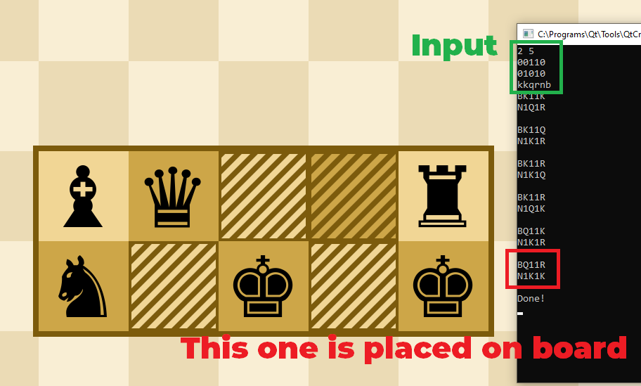

# Placement Solver
Solver for the game [Placement](https://github.com/Chainsawkitten/Placement)  
Steam Store Page: https://store.steampowered.com/app/700920/Placement

## Usage
```
<number of rows> <number of columns>
<description of field of size rows x columns where 0 - empty, 1 - blocked>
<string of available pieces (K - King, Q - Queen, N - Knight, R - Rook, B - Bishop, P - Pawn) (can be written in lowercase)>
```

## Example
